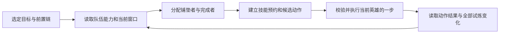

# 奇美拉试炼自动规划：现状分析与实施设计

> 2026-09-25：奇美拉已确认可在隔离原版引擎中完整模拟，试炼规则可从游戏数据精确读取，战斗可精确分叉。本文的启发式规划方案将被“离线规划 + 精确执行”取代，见 [奇美拉离线战斗模拟与按试炼选技能](chimera-offline-simulation-research.md)。

分析日期：2026-09-06。基于当前 1.0.5 源码、本地游戏目录数据、原任务中的实战反馈，以及七项不连接游戏的离线推演。本次新增分析文档和独立推演记录，不修改控制器、代理或 EXE。

## 结论

应把系统划分为“目标可行性分析”和“团队行动规划”两层，共用精确的试炼语义、技能能力和实际进度记录。

优先实现用户已选目标的可靠执行。自动推荐试炼集合可以随后复用同一套能力判断。当前系统不足以仅通过调整几个评分权重实现稳定自动试炼：它的核心仍是当前行动英雄的局部选择，缺少完整的进度语义、团队动作依赖和统一技能预留。

原任务在 1.0.2 阶段已经提出团队滚动规划器。当前确实落实了前置链展开、按目标限制候选、进度观察、部分效果贡献记录和技能预留，但未实现当时设计中的完整团队调度。因此应以源码和可回放结果作为实施完成标准。

## 一、现有机制及实证问题

入口 `evaluate()` 依次处理首回合设置、严格规则、试炼自动规则、默认技能。`execute_trial_recipe_decision()` 按候选试炼遍历，遇到能执行的补效果、伤害或其他动作立即返回。最后尝试保留当前英雄的部分提供技能，否则回到普通战斗。

### 1. 候选试炼主要按列表顺序决定

`eligible_ids` 沿用请求顺序，没有比较剩余有效窗口、完成剩余成本、后继链价值或目标之间的冲突。在推演中，仅交换两个可推进试炼的顺序，选中试炼即从 8000501 变成 8000505。后者已接近完成这一事实不改变选择。

这不表示用户明确设定的优先级应被忽略；问题在于目前没有区分“用户明确优先级”和“选中列表的偶然顺序”。也没有给所有候选动作统一比较机会。

### 2. 技能能力与试炼事件没有分清

`skill_mechanics()` 使用子字符串识别反击等机制。本地目录中格温妮丝技能 63301 的说明是“攻击所有敌人。此攻击不会触发反击。”，实际函数仍返回 `counterattack`，进而在 8000606 中拒绝它。本地目录存在六个匹配此类否定描述的技能。

“技能能赋予反击”“本次行动由反击触发”“本次攻击不触发敌方反击”是三个不同概念。应分别建模，不能共用一个布尔标记。包含额外伤害、被动或组队攻击的技能也需要区分一次施法、各段事件和最终被游戏计入的进度；不能仅凭整段技能说明替代事件分类。

### 3. 试炼计数类型混用

当前 `observe_action_damage()` 将总伤害差和试炼 `current` 差都记入名为 `emaDamage` 的统计，再让 `damage_score()` 在有试炼样本时改用后者。推演得到同一技能的全局分数为 500000，而某试炼的分数为 1；这两种值可能分别是伤害和计数，没有单位区分。没有试炼样本的另一技能又可能使用全局伤害，因此候选间也可能比较不同单位。

单次门槛、累计伤害、效果种类集合、施加次数和持续回合需要分别处理。单次阈值不能用累计值判断，也不能未经验证就把 `after.current - before.current` 当成该技能本次的合格伤害。

原任务中忍者画面伤害与 8000606 完成状态不一致的反馈，也说明需要记录动作前条件、动作来源和游戏进度回执。已有记录不足以在本次分析中还原那次具体施法，不能认定其唯一原因。

### 4. 不同减益被“用过哪些技能”近似替代

`trialContributors` 保存技能类型，而非游戏已经接受的效果身份。`distinct_effect_progress_decision()` 允许尚未贡献过的另一个技能重新施加当前已有的同类效果。

推演中，技能 A 和 B 都只提供效果 150，A 已记录为贡献者、效果仍在 Boss 身上，函数仍选择 B。该动作可能有刷新持续时间的价值，但不能据此预测它能增加“不同减益”计数。反过来，同一技能包含多个效果且部分被抵抗时，整个技能被记为用过也会丢失信息。

当前代理已提供 `effectGroupId`、`producerId`、`skillTypeId`、`applyTurn` 等字段，但能力归一化和身份比较没有完整保留这些语义。试炼究竟按类型、组、成功施加次数还是其他身份计数，需要逐类验证，不能先统一按组去重。

### 5. 窗口和自动化标记尚未形成执行约束

本地目录对终极噩梦 8000608 明确写的是“2 个回合内”，共享配方仍携带 `threeBossTurns`。控制器也未消费这个持续回合标签。不同难度目前主要覆盖数量阈值，不能表达完整的窗口差异。

现有配方有 15 项 automatic、8 项 assisted、4 项 manual。这些是配置标签，不是经过实战证明的成功率。文档说 manual 会暂停，但实际 Duel 配方没有专用动作时会继续普通战斗；有些 manual 配方还会尝试根据文本识别出的机制技能。推演确认了这一行为。

应明确区分：本场最终失败、当前形态不匹配、当前计数暂不能推进、已触发的局部计时窗口失效、前置尚未完成和数据未知。`canChangeProgress=false` 不能直接推导整场失败，但也不应完全忽略其对当前可贡献事件的约束。

### 6. 当前评分不以具体试炼成功为首要依据

`select_ready_boss_damage()` 先比较默认技能排名和通用辅助效果数量，再比较历史伤害。离线例子中，具有一个辅助效果、历史伤害 10000 的技能压过了历史伤害 1000000 的技能。

辅助技能在整队战斗中可能更有价值；问题在于这个排序没有判断辅助效果是否缺失、是否帮助当前试炼、是否会占用后续窗口，以及当前任务是否必须一次跨过伤害门槛。

### 7. 已有团队信息没有变成团队计划

代理的 `append_model_skills()` 已输出队友技能冷却，因此不是从零补齐所有团队状态。缺少的是“目标条件 → 提供英雄 → 技能 → 接受效果的英雄 → 有效窗口”的依赖关系，以及这些动作的统一预约。

当前预留多次以当前英雄、单个配方为范围计算，常在找到一个可用替代动作后返回，没有对所有未完成目标生成统一的资源时间表。`trialPlanner` 运行状态主要记录战斗上下文和贡献技能列表，没有跨英雄的动作阶段、预约截止时间或失败重规划。

## 二、建议的数据模型

### TrialDefinition：逐试炼、逐难度的语义

至少包含：试炼 ID、难度、形态、前置链、窗口起点与长度、最后有效窗口、条件检查时点、目标对象、允许及禁止事件、计数方式、完成条件、失效与重置规则、证据来源和定义指纹。

计数方式至少分为：

| 类型 | 判断依据 | 调度重点 |
| --- | --- | --- |
| 累计合格伤害 | 游戏确认的累计增量 | 单位动作贡献和剩余窗口 |
| 单次合格施法门槛 | 一次合格施法是否跨线 | 动作前条件与保守伤害估计 |
| 不同效果集合 | 已确认的计入身份及游戏总计数 | 缺少哪种效果、谁能提供 |
| 成功施加次数 | 游戏认可的成功事件次数 | 允许重复与否、抵抗、计时 |
| 连续/指定 Boss 回合条件 | 相应计时器与条件在检查点的真值 | 保持条件及中断后的规则 |
| 反击、组队攻击、吸收、复活等事件 | 经验证的事件类型及计数器 | 触发条件、参与者和结果 |

完成状态以游戏的 `completed` 为准；模型只提供预测。`CurrentProgress`、`CurrentCounter`、`CounterLimit`、`SelfTurnWhichCompleted` 的确切含义必须按试炼类型验证，不能只根据字段名猜测。

### TrialLedger：当前窗口的事实记录

按 battle ID、trial ID 和 window epoch 隔离，记录完整进度向量、条件历史、已证实/推断/未知的效果身份、局部窗口、动作观察及贡献归因。

如果游戏只暴露“6/7”而不暴露已计入的集合，单凭总数不能还原全部身份。应先寻找可读的内部集合；读不到时记录候选身份和置信度，遇到多事件同帧只更新总计数，不把全部增量强行归给最后一个技能。中途接管时尤其不能把当前效果集合视为完整历史。

### TeamCapabilities：带来源和条件的队伍能力

每个英雄实例和形态关联技能、当前/最大冷却、主动与被动、命令目标和实际受益对象、效果施加顺序、概率、持续时间、伤害事件类别、额外回合、变形步骤及必要前置。

被动技能作为可触发的事件依赖进入计划，不作为可以直接点击的动作。未验证的被动触发和内部冷却标记为未知。

技能文本用于生成候选标签；正式资格判断使用校验后的技能结构及观察证据。通用效果能力可复用，伤害数据按账户、英雄实例、形态、难度和相关战斗条件隔离。缺少可靠装备/属性指纹时，优先使用本场样本并降低跨场数据权重。

## 三、团队调度如何执行

### 1. 先定义目标优先级

已勾选必做试炼是约束，自动推荐不能在战斗中悄悄移除它们。前置链由完整定义展开，并和实时解锁状态交叉核对。冲突或未知前置需要明确显示。

未显式指定优先顺序时，应比较期限、完成剩余成本、后续链是否会被耽误及多个目标的共同收益。用户希望固定优先级时使用单独字段，不让数组位置隐式承担此含义。

### 2. 为里程碑分配具体英雄

例如 8000604 的计划应描述：谁先提供增加精准；哪几个英雄在增益有效期间施加哪些不同减益；哪些减益需要备用提供者；效果槽是否足够；完成后如何衔接 8000605 和 8000606。

增益的受益者是下一位要施加减益或输出的英雄，不一定是当前行动英雄。一次全队增益可以服务多个节点，清除、覆盖、延长或转换效果也必须计入对其他节点的影响。

### 3. 用带截止时间的技能预约

每个预约包含英雄实例、形态、技能、用途、最迟使用时点、预期恢复时点、释放条件和所属计划版本。

“现在使用后还能在目标窗口恢复”时可以使用；无法恢复且没有替代者时保留。冷却按技能所属英雄的行动推进，效果寿命按经验证的实际减计时点推进，不用一个固定 Boss 回合数统一代替。

所有待办目标共享预约表，任何默认或试炼替代动作都检查同一份约束。预约随目标完成、窗口失效、替代者就绪或计划变更释放，避免整场保留。

### 4. 每次只提交当前英雄的一步

系统不能改变游戏中已经决定的行动顺序。规划器可以预测后续顺序，但实际只为当前可行动英雄选动作，并在下一次观察时重新核对。

现有快照没有提供可直接依赖的完整未来行动序列。需优先调查可读行动条/待执行事件；无法取得时使用观测顺序和行动间隔的保守范围。额外回合、行动条变化、控制、死亡或变形都会使预测失效，不能把平均速度比当确定排程。

第一版使用明确的阶段任务和确定性选择即可：准备条件、等待提供者、执行完成动作、等待游戏计数、推进下一节点。稳定后再加入小规模搜索，比较未来几步的替代计划。

可试验的搜索起点是未来 6 个行动事件、保留 24 个候选分支、每节点至多 8 个有意义动作；这是待基准测试的参数，不是已测性能。超预算时采用已验证的可行首步，不能阻塞暂停和守卫检查。

### 5. 排序应先满足约束，再比较收益

依次检查：

1. 账户、回合、技能、合法目标和会话等现有执行守卫。
2. 用户首回合设置、严格规则及明确禁止使用的技能。
3. 是否破坏必做试炼的唯一可行路径或必要生存条件。
4. 本动作是否完成紧迫里程碑、建立下一步前置或帮助多条链。
5. 成功把握、重试机会、冷却成本和条件浪费。
6. 普通伤害与默认技能偏好。

严格规则仍保持原有优先语义。若它们与试炼目标冲突，应报告具体规则和被占用技能；规划器不能静默改写规则。默认技能“禁止默认释放”与“禁止所有自动模块使用”需要分别表达。

## 四、两项重点试炼的具体方案

### 8000604：增加精准下施加七种不同减益

- 进入窗口前核对增加精准的提供者、持续时间以及实际施加减益的英雄。
- 以游戏认可的身份建立“已计入/待补/不确定”集合，不直接数 Boss 当前图标。
- 根据成功率、实际时序和效果槽选择一组互补技能；同类替换和重复刷新单独评估。
- 对唯一提供第七种减益的技能建立预约；通用输出不应提前消耗它。
- 施法后核对游戏计数。被抵抗、已重复、前置未满足和归因不明确分别记录。
- 卡在 6/7 时定位缺少或不确定的身份，改用备用技能或恢复条件；不能仅换一个同效果技能轮流试。

### 8000606：虚弱与降低防御下的一次技能门槛

- 准备阶段明确两种减益必须在哪个事件检查点已存在；同一技能“先伤害、后降防”不能假定可以自给前置。
- 单独评估普通施法、反击、组队攻击和其他额外伤害事件的资格。对混合伤害技能的整体/分量排除规则逐项取证，避免根据一个文本关键词下结论。
- 单次阈值使用合格施法结果的分布或保守区间，不能用总伤害累计或其他试炼计数当估计。
- 为合格输出者预约爆发技能，铺垫完成后以实际行动顺序安排输出。
- 条件不足时保留必要技能并安排可行替代动作；所有现有动作都不可行时给出具体原因。
- 游戏 `completed` 才能确认完成。样本不足时展示不确定性，不显示伪精确成功率。

## 五、自动挑选适合队伍的试炼

它应复用上述计划可行性判断，而不是另做一个关键词匹配器。

开战前对目标集合联合分析：前置闭包是否可完成、技能提供者是否存在、窗口内动作数是否足够、多个试炼是否争用唯一技能、存活条件是否冲突，以及伤害目标能否兼顾。不能把每个试炼单独可行当成全部一起可行。

推荐结果可分为“有充分依据”“需要验证”“缺少必要能力”，并列出缺项和冲突；不能仅以静态 automatic 标签推荐。用户固定的必做目标保持选中，即使不可行也明确说明原因。

没有偏好时，推荐优先提高整套目标的完成可靠性，再比较试炼奖励与预计战斗时间。确切奖励来自当前轮换目录。推荐结果不自动改变用户的提前重整条件。

## 六、动作回执与学习

为每次受控行动记录 session、battle ID、command nonce、英雄实例、形态、技能、目标、动作前条件和全部试炼的前后进度。区分“命令接受”“动作执行”“试炼计入”。

当前代码等待 `turn_key` 变化后计算总伤害差，该间隔可能同时包含持续伤害、被动、Boss 响应或其他动作。因此先保留为相关观察；取得明确事件归属后才能作为对应技能的可靠样本。动作失败或归因不明的记录也应保留原因。

观察全部试炼，而不只观察 `decision.trial_id`，才能发现严格规则、默认技能和一个动作对多条链的实际贡献。事件记录使用有容量与序号的独立通道，不能不断扩大已有每回合快照；溢出时明确标注缺失并降低置信度。

统计按任务类型区分成功计数、有效伤害、施加成功率、持续覆盖和失败原因。样本量少时使用区间；不会因为一次暴击认定稳定达标，也不会因为一次抵抗永久排除提供者。

## 七、实施顺序与验收门槛

| 阶段 | 实现范围 | 可以检查的交付标准 |
| --- | --- | --- |
| A：修正事实模型 | 试炼计数类型、难度窗口、技能事件资格、自动化支持边界 | 七项现有推演行为逐项有解释和对应回归；162 个具体试炼都有定义覆盖或明确未知状态 |
| B：建立事实记录 | 全队能力、全部试炼进度、动作关联和身份集合置信度 | 能重放“为何 6/7”“为何一次伤害未计入”，证据不足也有明确输出 |
| C：首个团队规划闭环 | 先做 8000604→8000605→8000606，覆盖提供者、预约和备用动作 | 在完整形态序列回放中，守住技能、应对抵抗、完成后转入下一节点，并保持严格规则语义 |
| D：扩展与推荐 | 其他计数类型、特殊机制、目标集合推荐 | 每类具备独立事件语义、回放用例与实战记录后再标为可可靠自动执行 |

现有测试主要验证局部快照输入输出，适合保留为底层回归，但不能证明整场计划有效。新增验收至少覆盖：

- 目标顺序变化但目标优先级不变时，计划不因列表位置漂移。
- 同效果由不同技能施加、同技能部分效果抵抗、计数重置及中途接管。
- 单次伤害与累计伤害、同技能先伤害后效果、反击否定描述。
- 不同难度的 2/3/5 回合窗口，效果按实际角色回合消耗。
- 两个目标争用一个技能，以及一技能可同时推进多个目标。
- 额外回合、控制、死亡、变形失败、手动操作和延迟状态引发重规划。
- 未知机制不会冒充完整自动执行，预测不足也不会自行触发新增重整条件。

真实回放用于诊断，不能证明没执行过的替代动作一定成功；替代策略需要显式的离线转移模型和后续受控实战验证。实战先记录建议与实际动作差异，再在明确范围启用执行，比较按首次窗口完成率、每次目标尝试的成功率、重整次数和完成耗时，而不是仅比较总伤害。

建议下一次实现的最小完整范围为 A、B，以及 C 的一条链。先用这个范围证明团队调度可靠，再扩大到全部试炼。

## 源码与分析记录

- `tools/chimera_controller.py`：`evaluate`、`execute_trial_recipe_decision`、`skill_mechanics`、`distinct_effect_progress_decision`、`select_ready_boss_damage`、`SkillCapabilityMemory`、`process_state`。
- `src/agent/agent.cpp`：`append_model_skills`、`append_model_challenges`、`ModelChallengeSnapshot` 及效果快照。
- `data/chimera-trial-recipes.json` 与 `cache/chimera-ui-catalog.json`：配方和本地目录对照。
- `out/trial-planner-analysis-20260906/probe.py`、同目录 `findings.json`：七项离线推演及结果。

这些推演用于证明当前选择机制的局限，不能当作新规划器已经实现或真实战斗已经验证的证据。
