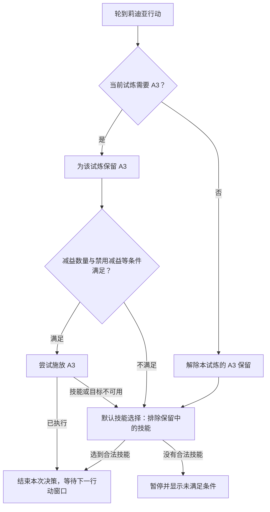

# 规则流程图设计建议

可以实现。建议保留现有列表作为简洁入口，增加“流程图”编辑方式：按英雄（奇美拉再按形态）分组，条件通过“满足／不满足”两条线连接，技能通过“已执行／不可用”区分结果，公共动作允许多个分支连接。详细条件放在节点侧栏，画布上只显示摘要。

## 一个实际例子

这里的“当前试炼需要 A3”是用户配置的试炼范围，不能仅凭节点文字推测。既有规则的英雄、形态、试炼链资格、增减益数量等都应以可编辑参数显式呈现。

## 当前代码已经具备什么

- `validate_strategy_node()` 和 `_evaluate_strategy_node()` 支持 priority/selector、branch/condition 的 then/else，以及施放、变形、维持效果、自动试炼和默认技能动作，因此基础条件分支不需要从头写执行器。
- `conditionTree` 现有 AND/OR/NOT 条件可以成为一个条件节点内部的“全部满足／任意满足／取反”。简单条件直接显示在画布中，复杂组合才展开侧栏。
- 现有出手诊断包含命中条件、技能可用性和合法目标，可用于高亮本回合实际走过的线路。

## 不能只换一层画布的部分

1. **隐含优先级必须显式转换。** 目前列表并非严格从上到下：首回合配置先执行，其后严格规则、自动试炼、默认技能分阶段执行。迁移必须保留这个顺序，不能按列表原始位置直接连线。
2. **技能保留必须是独立规则。** 现在保留技能主要从平面 rules 收集；直接启用 strategyTree，并不保证图中分支拥有相同的保留语义。应提取共同的保留策略，明确适用英雄、形态、试炼范围和解除条件；默认、首回合及共享动作都受它约束。
3. **共享分支需要真正的图结构。** 现有树通过嵌套对象表达，不能直接引用共享节点。用 `nodes[id]` 与 `edges` 保存连线；初版只允许有向无环图。不要为了界面上看着少嵌套，在存储中大量复制同一子树。
4. **条件为假与动作不可用要分开。** 试炼条件未满足时可能需要保留技能；技能在冷却时则可能走备用动作。连线应明确表达这两种结果，不能统一当成“没匹配”。
   当前树的 pause 节点返回 None，在上层 selector 中仍可能继续尝试其他节点；流程图需要独立的“停止本次决策”结果，避免画布上的“暂停”实际只是“跳过”。
5. **执行边界不由画布改变。** 每次基于一个当前行动快照求值，只提交一次合法动作；实际目标、技能准备状态、账户绑定和接管状态仍在现有执行层核对。下一回合重新从入口求值。界面“测试此节点”只离线计算，不直接执行游戏动作。
6. **运行中编辑保持草稿。** 当前控制器使用启动时的策略快照。流程图也应显示“草稿／当前执行版本”，保存不会悄悄切换正在执行的流程。

## 建议分步交付

先把已有策略显示为只读流程图，高亮命中路径，并在离线快照上验证与旧引擎相同的选择。再开放拖动、连接和节点参数编辑，提供撤销、节点搜索、分组折叠与画布定位。最后增加共享子流程和模板。

迁移前保留原策略；不可逆的图不强行转换回简单列表。发布前重点覆盖：旧策略与转换后的选择等价、试炼保留不被备用分支绕过、未命中与不可用分支区别、多个分支共用动作、环路/断线验证，以及一次决策最多执行一个动作。

本轮只完成面板整理、折叠和规则查找；流程图编辑器是上述下一阶段设计，尚未启用。
